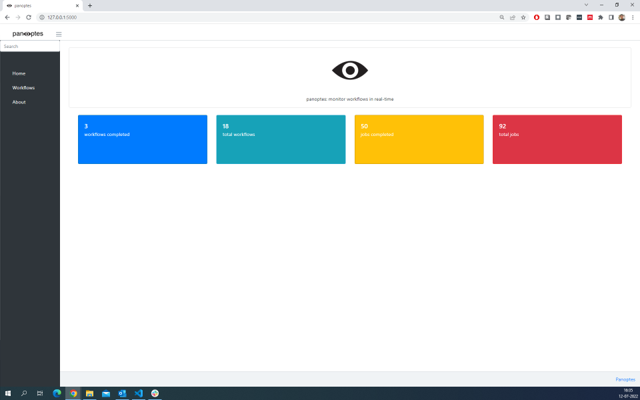
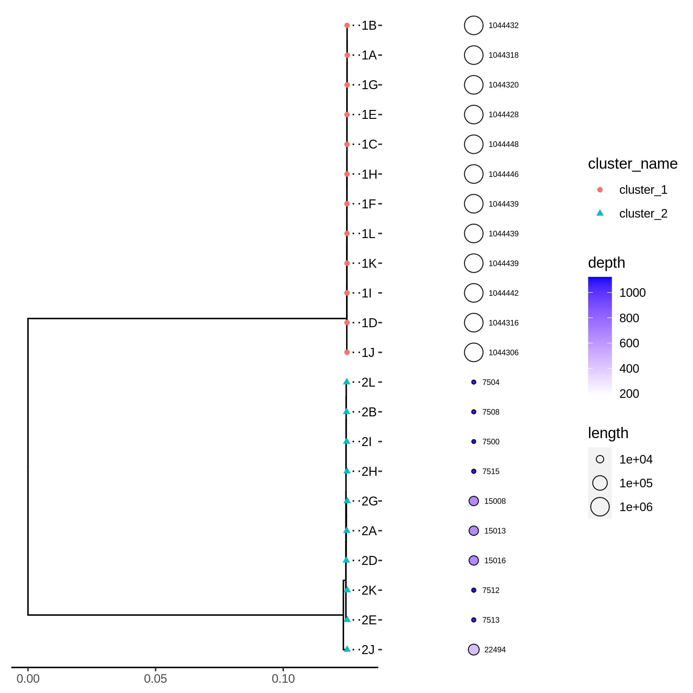

# Snakemake Wrapper: Trycycler Genome Assembly

[](https://snakemake.github.io)

This is a snakemake wrapper to run [trycylcer](https://github.com/rrwick/Trycycler). The sub-workflows are divided into three different steps, following the original author's instruction: https://github.com/rrwick/Trycycler/wiki. See [step 4](#step-4-executing-the-workflow) for how to run the subworkflows.

## Tutorial
### Step 1: Clone the workflow

[Clone](https://help.github.com/en/articles/cloning-a-repository) this repository to your local system, into the place where you want to perform the data analysis. 

    git clone git@github.com:matinnuhamunada/trycycler_snakemake_wrapper.git
    cd trycycler_snakemake_wrapper

### Step 2: Get example data
```shell
mkdir -p data/raw/GCF_000012125
wget -O data/raw/GCF_000012125/23754659.tar.gz https://bridges.monash.edu/ndownloader/files/23754659
(cd data/raw/GCF_000012125 && tar -xvzf 23754659.tar.gz)
```
### Step 3: Configure workflow
#### Setting Up Your Samples Information
Configure the workflow according to your needs via editing the files in the `config/` folder. Adjust `config.yaml` to configure the workflow execution, and `samples.tsv` to specify the strains to assemble. The file `units.tsv` contains the location of the paired illumina and nanopore reads for each strain.

`samples.tsv` example:

|  strain       |       description |
|--------------:|------------------:|
| GCF_000012125 | Example |

`units.tsv` example:

|  strain       |  unit |    illumina_reads |               nanopore_reads |
|--------------:|------:|------------------:|-----------------------------:|
| GCF_000012125 | 1     |                   | data/raw/GCF_000012125.1     |

Further formatting rules will be defined in the `workflow/schemas/` folder.

### Step 3: Install Snakemake

Installing Snakemake using [Mamba](https://github.com/mamba-org/mamba) is advised. In case you don’t use [Mambaforge](https://github.com/conda-forge/miniforge#mambaforge) you can always install [Mamba](https://github.com/mamba-org/mamba) into any other Conda-based Python distribution with:

    conda install -n base -c conda-forge mamba

Then install Snakemake with:

    mamba create -c conda-forge -c bioconda -c panoptes-organization -n snakemake snakemake panoptes-ui

For installation details, see the [instructions in the Snakemake documentation](https://snakemake.readthedocs.io/en/stable/getting_started/installation.html).

### Step 4: Executing the workflow

Activate the conda environment:

    conda activate snakemake

Run panoptes to monitor jobs:

    tmux new-session -A -s panoptes \; send -t panoptes "conda activate snakemake && panoptes" ENTER \; detach -s panoptes # run panoptes in background at http://127.0.0.1:5000

Do a dry-run:

    snakemake --snakefile workflow/Snakefile-assembly --use-conda --cores $N --wms-monitor http://127.0.0.1:5000 -n

We can then open `http://127.0.0.1:5000` to monitor our jobs


See the [Snakemake documentation](https://snakemake.readthedocs.io/en/stable/executable.html) for further snakemake CLI details.

#### Results structure
The results can be found in the `data` folder and are separated into three stages: `raw`, `interim`, and `processed`. Further, the results will be splitted into the three steps.

#### Part 1 - Generating Assemblies
##### Running snakefile
This step generates multiple assemblies as described in: https://github.com/rrwick/Trycycler/wiki/Generating-assemblies

    snakemake --snakefile workflow/Snakefile-assembly --use-conda --cores <n_cores> --wms-monitor http://127.0.0.1:5000 

##### Evaluating Assemblies
The first step in Trycycler is to generate assemblies from the subsampled data. Here, the subsets were assembled with three different assemblers. We can see that all assemblers agrees to generate a circular chromosome and a plasmid.

| *`data/processed/GCF_000012125/01_trycycler_assembly/GCF_000012125_graphs.png`* |

#### Part 2 - Clustering Contigs
##### Running the snakefile
This step clusters the assemblies into per-replicon groups as described in: https://github.com/rrwick/Trycycler/wiki/Clustering-contigs

    snakemake --snakefile workflow/Snakefile-cluster --use-conda --cores <n_cores> --wms-monitor http://127.0.0.1:5000 

This step also generate `data/interim/02_trycycler_cluster/cluster.yaml` which should be copied to the config folder in order to proceed to the next step.

```bash
cp data/interim/02_trycycler_cluster/cluster.yaml config/cluster.yaml
```
**NOTE:** You can select or drops the bad contigs or clusters that will be run in the next step. See below about evaluating the clusters.

##### Evaluating Contig Clusters
The second step in Trycycler is to cluster the contigs. Here we can see how the chromosome and the plasmid are grouped in different cluster. Each cluster should have similar length and read depths.

| *`data/processed/GCF_000012125/02_trycycler_cluster/GCF_000012125_cluster.png`* |

As we can see in the figure, the plasmid sizes after the assembly is a bit weird. There are some contigs with 7500 bp and some with 15kb and 22kb. Open up the `data/interim/02_trycycler_cluster/cluster.yaml` and remove the contigs from cluster 2 which have length > than 8 kb.

```yaml
GCF_000012125:
  cluster_001:
    - A_contig_1
    - B_utg000001c
    - C_Utg422
    - D_contig_1
    - E_utg000001c
    - F_Utg418
    - G_contig_1
    - H_utg000001c
    - I_Utg428
    - J_contig_1
    - K_utg000002c
    - L_Utg448
  cluster_002:
    - B_utg000002c
    - E_utg000002c
    - H_utg000002c
    - I_Utg430
    - K_utg000001c
    - L_Utg450
```

#### Part 3 - Generating Consensus
This step summarizes step 3, 4, 5, and 6 in the Trycycler wiki and generate the consensus contig sequence as described in: https://github.com/rrwick/Trycycler/wiki/Generating-a-consensus


    snakemake --snakefile workflow/Snakefile-consensus --use-conda --cores <n_cores> --wms-monitor http://127.0.0.1:5000 

The final assembly can be found in `data/processed/GCF_000012125/03_trycycler_consensus/GCF_000012125.fna`


### Step 5: Investigate results
`TO DO`
